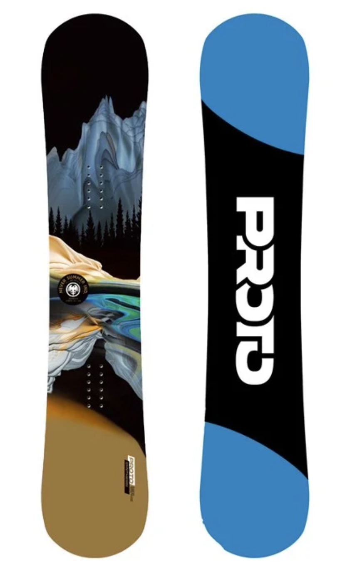
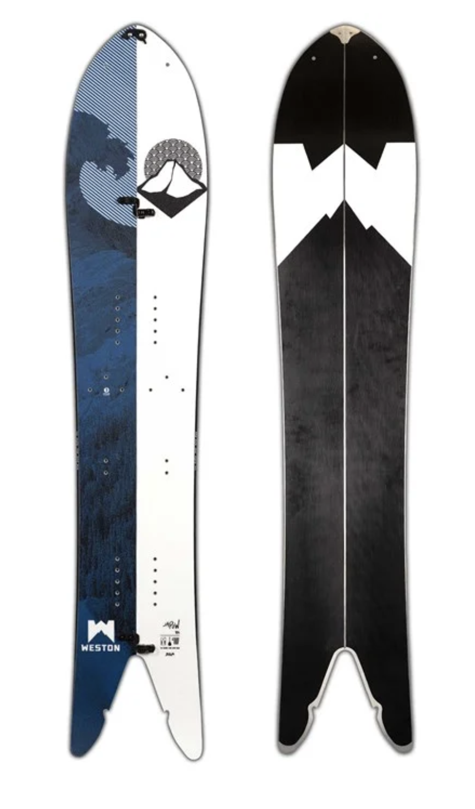
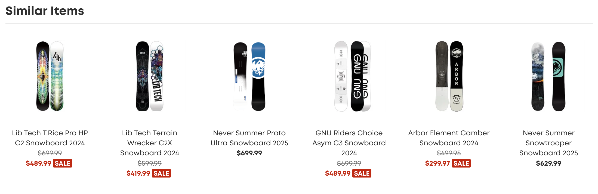
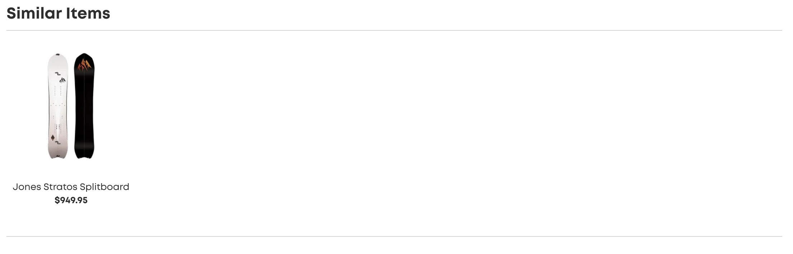

```{r setup, include=FALSE}
knitr::opts_chunk$set(echo = TRUE)
```

## Introduction

As winter draws closer so does ski season! In Denver we are currently experiencing the largest November snow storm in decades, with over a foot of snow predicted by the end. Ski resorts in the Rockies are opening earlier than they have in decades, and that means people are more excited than ever to hit the slopes. [Evo.com](https://www.evo.com/) is one of the largest retailers of ski, snowboard, and winter gear in the United States with a massive online presence as well as brick and mortar stores in winter sports meccas Denver, Portland, Seattle, and Salt Lake City. We will be taking a deeper look at the recommender systems they have in place for their products and will discuss potential improvements.

In order to provide context for the recommender system discussion, we first need to cover some basics regarding winter sports equipment. We will be limiting our analysis to Snowboard equipment since, as we will discuss later, the recommendation system used by Evo is fairly simple and limiting our discussion scope will ease understanding and provide a consistent example throughout our analysis. We will be using the two snowboards below in our examples, easily distinguishable visually and geared towards very different riders. There are many characteristics that distinguish these boards from one another beyond shape which will be touched on in our analysis.

:::: {style="display: flex;"}

::: {}
```{r twin, echo=FALSE, out.width="49%", out.height="20%", fig.cap="Board 1 is a twin board, geared towards tricks in the park and groomed runs.", fig.align="center"}

```
:::

::: {}
```{r split, echo=FALSE, out.width="49%", out.height="20%", fig.align="center", fig.cap="Board 2 is a powder splitboard, geared towards backcountry and deep powder."}

```
:::
::::


## Scenario Analysis

The goals of an online retailer are self-evident, but we can explore how they can be best achieved for the given population.

1. Who are your target users?

Outdoor sports enthusiasts looking to purchase gear for their hobbies. It should be noted that Evo provides gear for sports such as mountain biking and surfing in addition to snow sports. There is a high degree of overlap among consumers engaged in these sports, as they are highly seasonal and either involve very similar skill sets (snowboarding and surfing or skiing and water skiing) or make use of the same locations (many ski resorts have mountain biking trails in the summer and early fall).

2. What are their key goals?

Acquiring the gear they need for the upcoming season or capitalizing on end of season deals. There are additional services provided such as rentals or gear tuning, but the majority of the site is dedicated to primary gear (mountain bikes, snowboards, skis) and accessories (helmets, gloves, jackets). Due to the highly seasonal nature of these sports there are regular end of season sales which attract the budget conscious, so prominently highlighting sale items for out of season sports can continue to drive traffic from users only interested in one sport.

3. How can you help them accomplish those goals?

Recommending similar products to what they have viewed in the past can provide options, and highlighting deals on last season's gear can drive sales from more budget conscious shoppers. If a customer is looking at primary gear, in our case a snowboard, they likely also need secondary gear like bindings or boots. Highlighting bundles of bindings and boots that include the currently selected board or recommending accessory gear like board locks, wax, or maintenance kits could make it easier for customers to get everything they need. Offering recommendations for items frequently bought together can help drive customers to combinations of items which are popular and perform well together, creating a better experience for the customers and increasing the odds of repeat business. Lastly, if a customer has looked at primary gear as well as accessory gear they are likely buying a whole set up, potentially to participate in the sport for the first time. In this case providing recommendations for safety gear (helmets, wrist guards) and clothing (jackets, snow pants, goggles) would be beneficial as well.

## Reverse Engineering

Figuring out what kind of recommendation system Evo is using is incredibly simple as their system is apparently very minimal. There are no recommendations anywhere except individual product pages, and those recommendations are only for similar products. Below are the recommendations for the two boards shown previously.

```{r twin_recs, echo=FALSE, out.width="100%", out.height="20%", fig.align="center", fig.cap="Recommendations for Board 1 consist solely of other twin boards."}

```

```{r split__recs, echo=FALSE, out.width="100%", out.height="20%", fig.align="center", fig.cap="Recommendations for Board 2 are sparse due to the highly specific nature of the board."}

```

## Recommendations for Improvement

There is a lot of room for improvement in the recommendations from Evo, some of which we have already touched on in our Scenario Analysis. Recommending products beyond similar items is a no brainer, however choosing what additional items to recommend is more complicated. Screen real estate is precious, and including too many recommendations is detrimental to the user experience. Looking at the individual product pages, keeping the similar products suggestions is a good place to start. Including one to two more "rows" of highly correlated secondary items from several possible recommendation categories on the product page would be an easy next step. An example of what this might look like for Board 1 would be including recommendations for softer (more "trick" oriented and beginner friendly) bindings in one row and another with boot recommendations or board/binding/boot bundles. For Board 2 the recommendations could be more specialized, such as splitboard skins and bindings which are both specific to this kind of board and unlikely to be already owned. Once a customer has added these items to their cart and is proceeding to the checkout there could be an additional set of more loosely correlated items such as repair kits, clothing, or safety equipment such as helmets or avalanche airbags.

A slightly unique improvement, and the one that originally drew my attention to this site, could be to recommend snowboards that are the "opposite" of what a customer is currently viewing or has previously purchased. While initially counter intuitive, with a little explanation the benefits of such an approach can be made clear. While there are "all mountain" boards designed to be pretty good at anything the rider may encounter in a typical resort (and these are often the most popular boards) there is also the concept of acquiring a "quiver" of boards for different situations. Simply put, it is not uncommon for an individual to own BOTH of our example boards and ride them on different days in different conditions. Beyond the shape the two boards vary in terms of weight, flex, profile, and other important characteristics to advanced riders who prefer the right "tool" for the job. These "opposite" recommendations would be useful across the sports that Evo sells equipment for and would be an interesting project to work on. 
